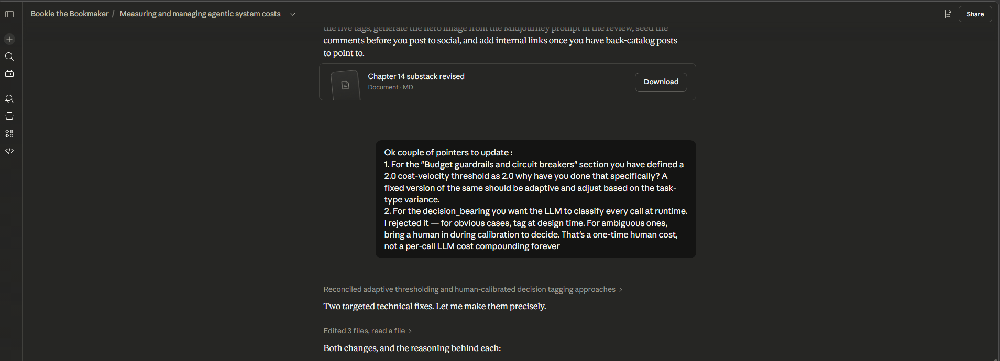

## STAGE 1 — Define Your Chapter's Core Claim (Day 1)

#### "After reading this chapter, a student will understand [architectural decision X] well enough to [make design choice Y] without making [mistake Z]."

After reading this chapter, a student will understand span-level cost observability and the dollar-per-decision metric as the correct unit economics for agentic systems well enough to design a FinOps pipeline with decision-bearing tagging, budget circuit breakers, and tiered model routing without making the mistake of monitoring cost at the aggregate billing level, which hides per-decision cost compounding and produces agents that look cheap per inference but are economically indefensible at production scale.

#### The Human Decision Node lives here. 

Ok couple of pointers to update : 
1. For the "Budget guardrails and circuit breakers" section you have defined a 2.0 cost-velocity threshold as 2.0 why have you done that specifically? A fixed version of the same should be adaptive and adjust based on the task-type variance.
2. For the decision_bearing you want the LLM to classify every call at runtime. I rejected it — for obvious cases, tag at design time. For ambiguous ones, bring a human in during calibration to decide. That's a one-time human cost, not a per-call LLM cost compounding forever
